# NLP-on-Stand-Up-Comedy-Transcripts-
Comparing stand up comedians using natural language processing

## Features

**_1.1 Getting and Cleaning the Data_**

  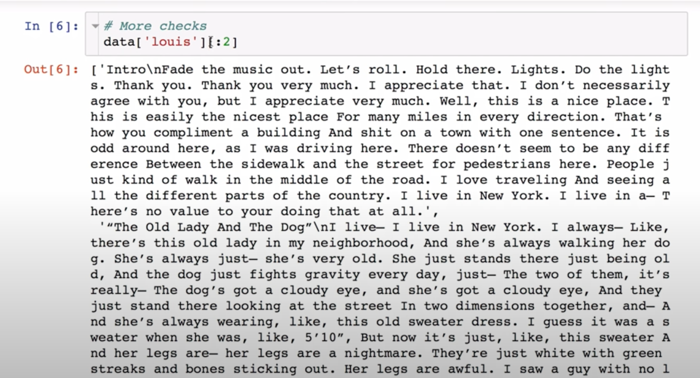

 
                                               
                                                                                           
**_1.2 Cleaning the Data_**

  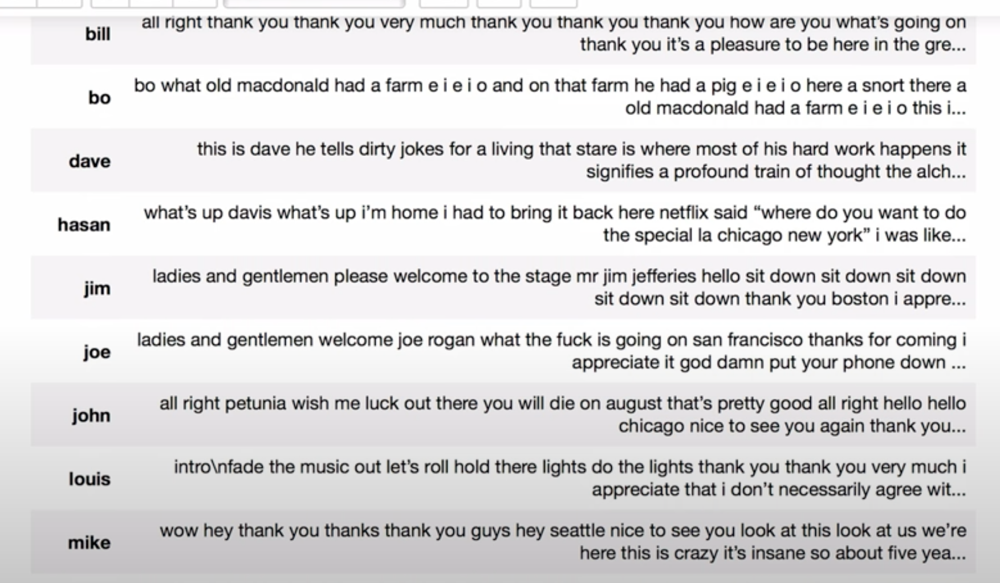

 

**_1.2 Document term matrix_**

  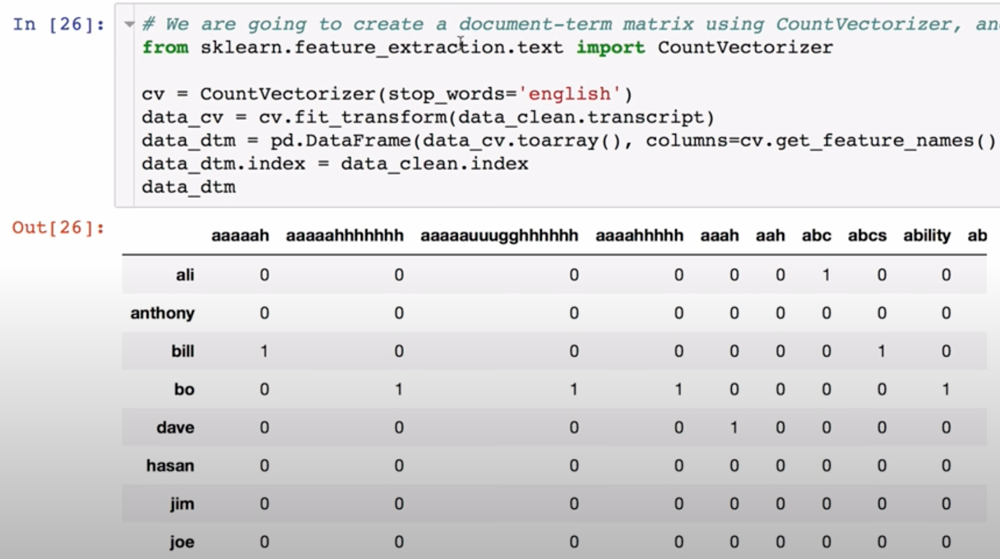

 

**_2.1 Most common words_**

  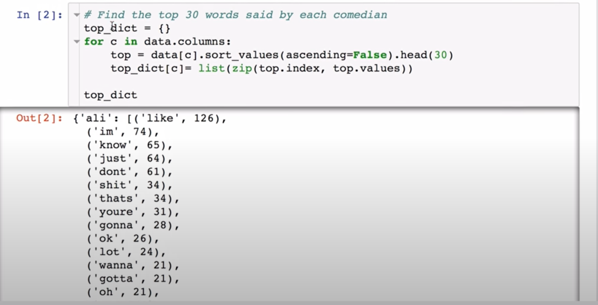
                                                                           
    1.)Ali Wong says the s-word a lot and talks about her husband. 
     2.)A lot of people use the F-word.                                                                        

 

**_2.2 Size of vocabulary_**

  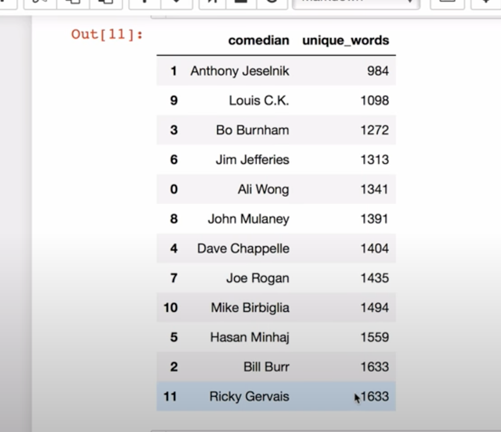
                                                                             
  1.)Ricky Gervais (British comedy) and Bill Burr (podcast host) use a lot of words in their comedy.
  2.)Louis C.K. (self-depricating comedy) and Anthony Jeselnik (dark humor) have a smaller vocabulary

 

**_2.3 Words per minute_**

  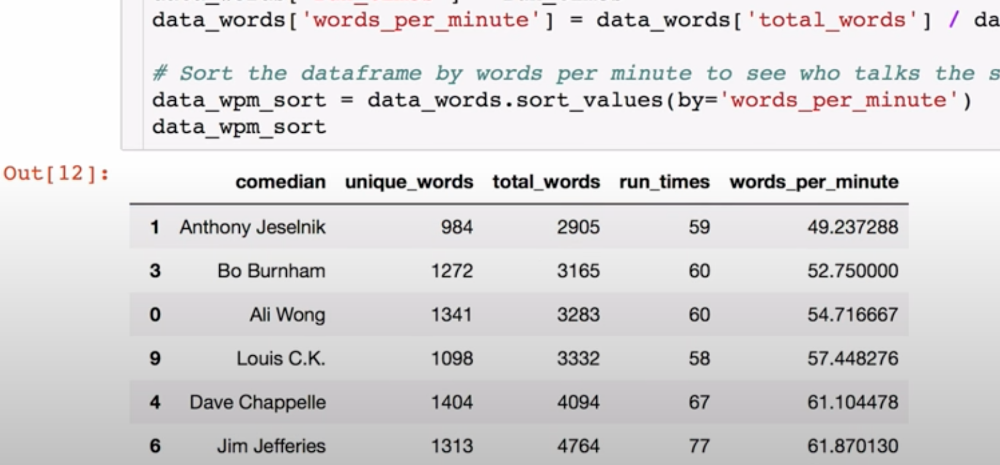
                                                                
     1.) Joe Rogan (blue comedy) and Bill Burr (podcast host) talk fast
     2.)Bo Burnham (musical comedy) and Anthony Jeselnik (dark humor) talk slow

 

**_2.4 Amount of profanity_**

  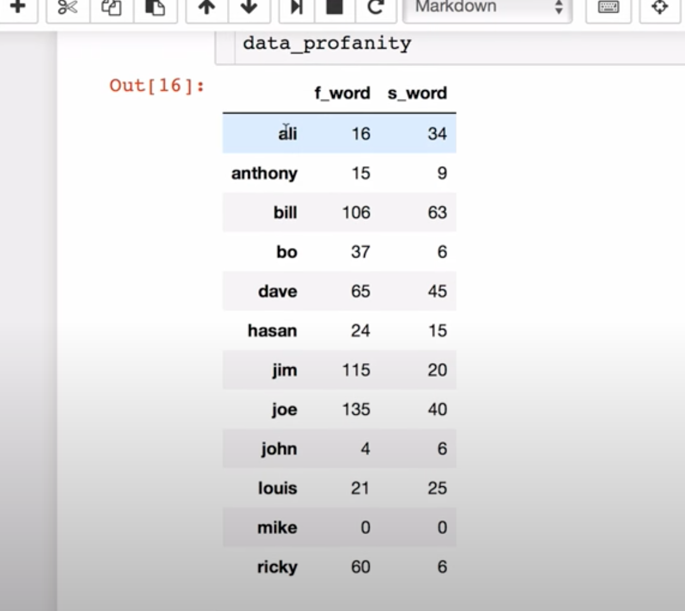
                                                            
       1.) Averaging 2 F-Bombs Per Minute! - I don't like too much swearing, especially the f-word, which is probably why I've never heard of Bill Bur, Joe Rogan and Jim Jefferies.
      2.)Clean Humor - It looks like profanity might be a good predictor of the type of comedy I like. Besides Ali Wong, my two other favorite comedians in this group are John Mulaney and Mike Birbiglia.                 
                                                   

 

**_3.1 Sentiment of Routine_**

  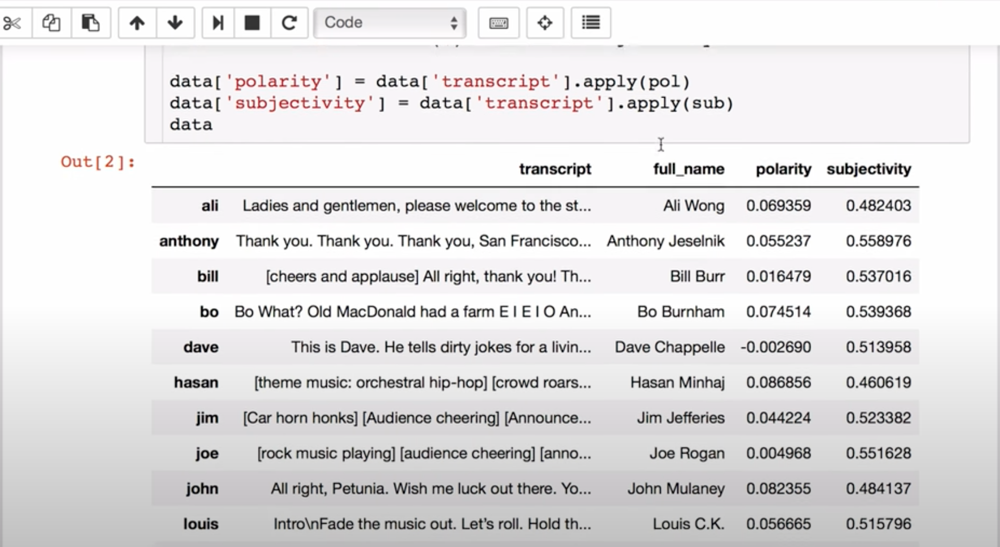
  

 

**_3.2 Sentiment of Routine Over Time_**

  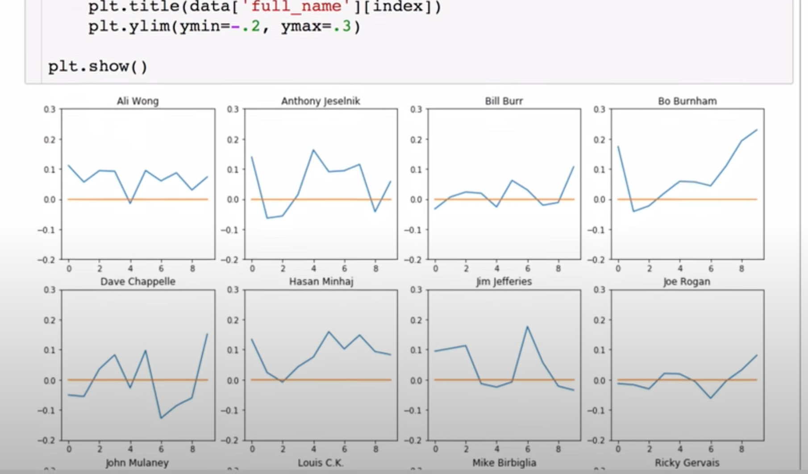
                                                                                 
    Ali Wong stays generally positive throughout her routine. Similar comedians are Louis C.K. and Mike Birbiglia.                                                                         
    On the other hand, you have some pretty different patterns here like Bo Burnham who gets happier as time passes and Dave Chappelle who has some pretty down moments in his routine.                                                                           

 

**_4.1 Topic modelling_**

  

 

**_4.2 Topic modelling(noun and adjectives)_**

  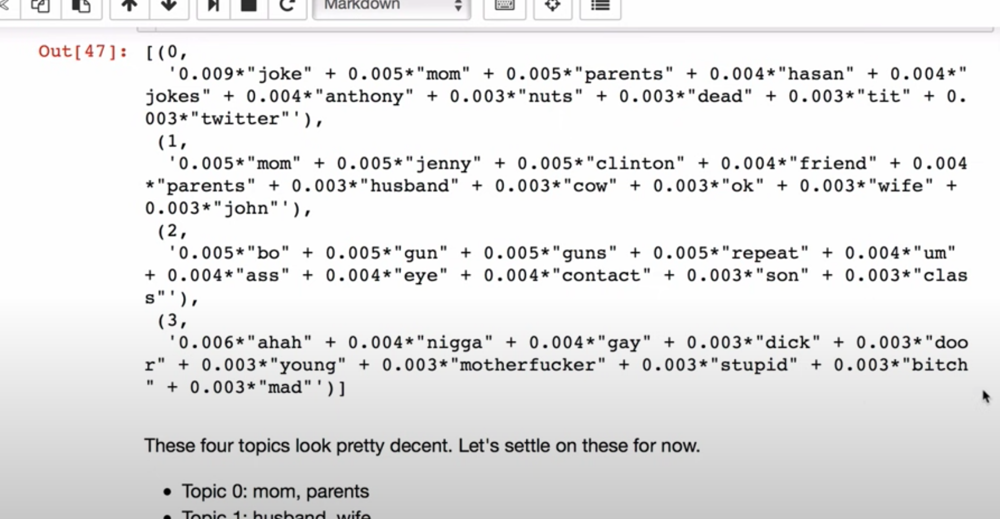

 

**_5.1 Markov Chain_**

  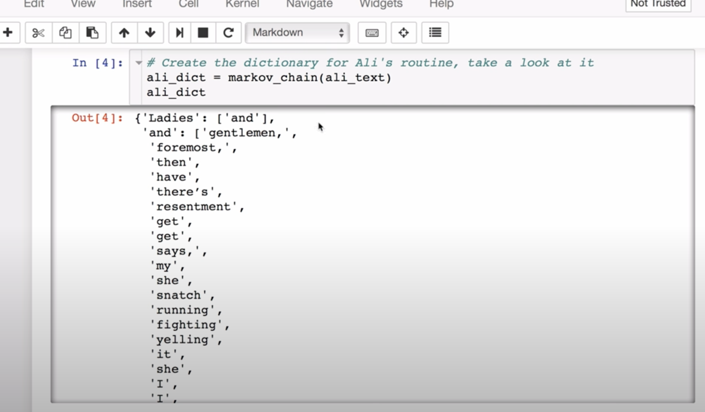

 

**_5.2 Text generation_**

  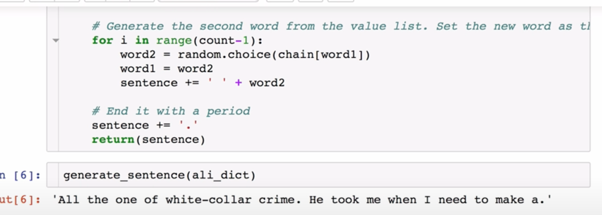

 

