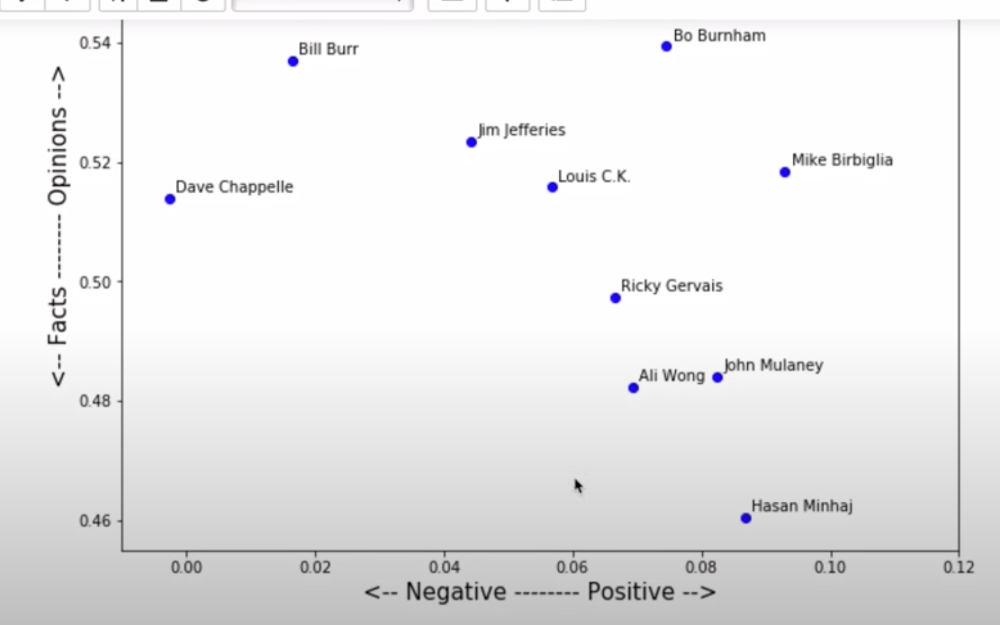

# NLP-on-Stand-Up-Comedy-Transcripts-
Comparing stand up comedians using natural language processing

## Features

**_1.1 Getting and Cleaning the Data_**

  

 
                                               
                                                                                           
**_1.2 Cleaning the Data_**

  

 

**_1.2 Document term matrix_**

  

 

**_2.1 Most common words_**

  
    1.)Ali Wong says the s-word a lot and talks about her husband. 
    2.)A lot of people use the F-word. Let's dig into that later.                                                                       

 

**_2.2 Size of vocabulary_**

  

 

**_2.3 Words per minute_**

  

 

**_2.4 Amount of profanity_**

  

 

**_3.1 Sentiment of Routine_**

  
  

 

**_3.2 Sentiment of Routine Over Time_**

  

 

**_4.1 Topic modelling_**

  

 

**_4.2 Topic modelling(noun and adjectives)_**

  

 

**_5.1 Markov Chain_**

  

 

**_5.2 Text generation_**

  

 

